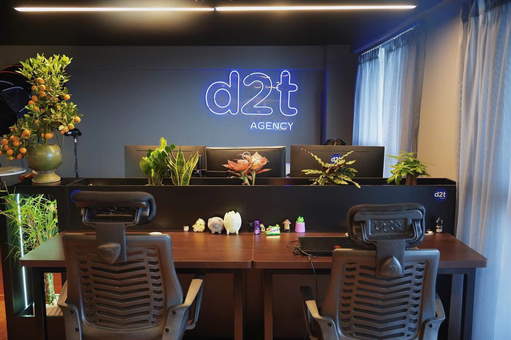

**Category:** Partnerships  
**Reading Time:** 4 Minutes

---

D2T Agency has opened its affiliate program for partners who can refer advertisers to its Facebook ad account rental services. The program is positioned as a simple, low-risk way to earn commissions by connecting qualified clients with D2T's account solutions.

<figure class="news-entry-image">
  
</figure>

---

## Why partners are joining

- **No startup capital:** You only connect clients. D2T handles onboarding and delivery.
- **Fast commissions:** Earn commission when a client successfully registers and rents a Facebook ad account.
- **Transparent terms:** Policies and workflows are documented and shared upfront.
- **Flexible schedule:** Work anytime, anywhere without fixed hours.

## How the signup flow works

1. **Send your registration details:** Connect with D2T Agency via Telegram, Facebook, or Zalo.
2. **Receive the service policy:** Get clear product and commission guidance for consistent messaging.
3. **Refer clients:** Share client needs and details with D2T Agency for qualification.
4. **Get paid:** Submit payout details and receive commission after each successful signup.

## FAQ highlights

**Is there a commission cap?**  
No. You can scale by leveraging your network or bundling D2T services into your offers.

**Are there any fees?**  
Some service fees may apply to ensure compliance with D2T and Facebook policies. The team clarifies this during onboarding.

**What do I need to prepare?**  
Learn D2T's service policies and ideal client profile. D2T handles the rest once a lead is qualified.

**When can I start?**  
Immediately. Once registered, collaboration can begin right away.

---

**Want to join?** Reach out via https://d2t.agency/lien-he/ or contact the D2T team on Telegram or Zalo to get started.
